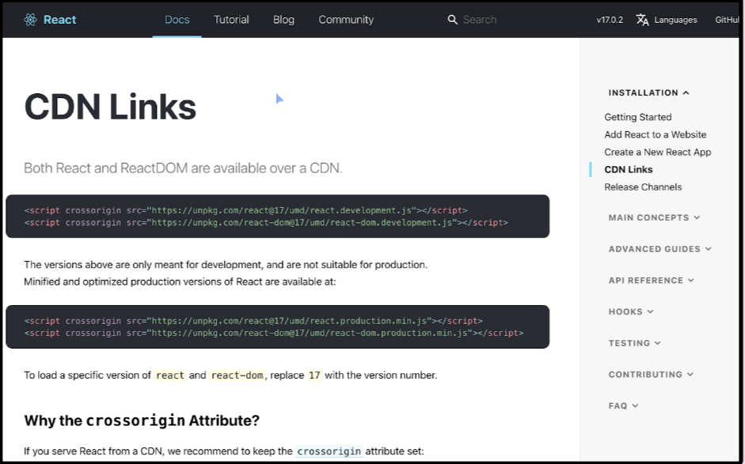

in the html head we add these scripts

        

in the body we add

ReactDOM.render(
Hi, my name is Bob!
, document.querySelector("#root"))

ReactDOM.render(<h1>Hi, my name is Bob!</h1>, document.getElementByID("root"))

render has two parameters: 
1.what to render
2.where to render
so render is taking first parameter and appending it to root (second parameter).

document.querySelector is another way to tell, where to render.

