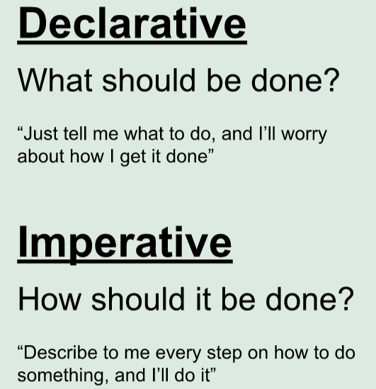

# Is react Declarative

 

example:
 Create a new h1 element
- Give it some textContent
- Give it a class name of "header"
- append it as a child of the div#root

# imperative way :

const h1 = document.createElement("h1")
h1.textContent = "This is an imperative way to program"
h1.className = "header"
document.getElementById("root").append(h1)

# declarative way:

ReactDOM.render(<h1 className="header">Hello, React!</h1>, document.getElementById("root"))
