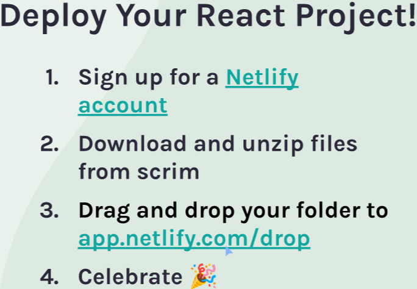

we can use netlify directly if we are using cdn links for babel in html
else need to do some extra steps

1. create a netlify account
2. go to netlify drop site  --https://app.netlify.com/drop?utm_source=scrimba&utm_medium=referral&utm_campaign=learnreact
3. drag and drop your whole code folder(not individual files)
4. you will be redirected to siteoverview dashboard and netlify will generate a random url for your site.
5. refresh to see the link to your project
6. click on the link to see that your project is now on the internet

